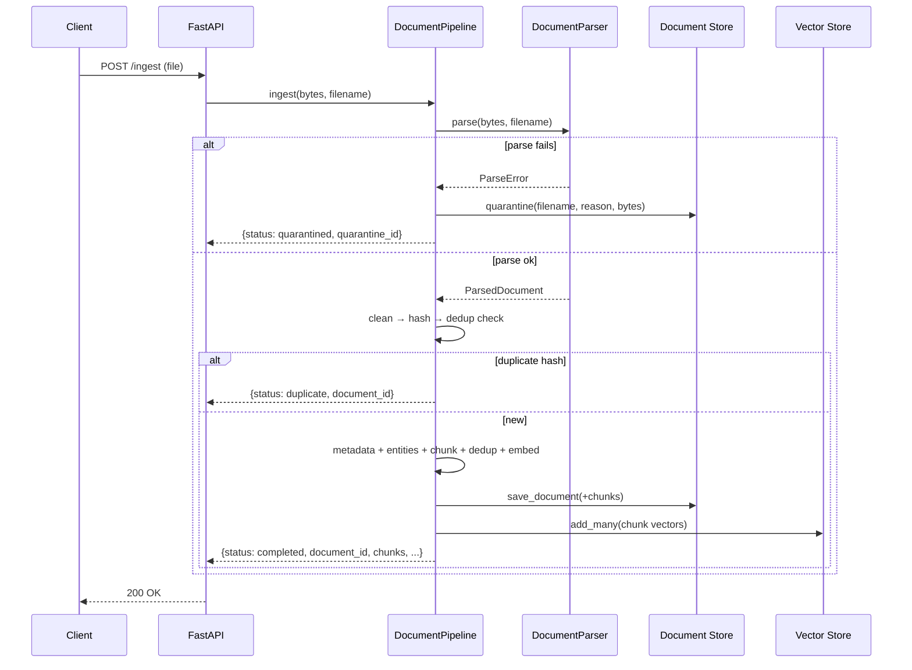
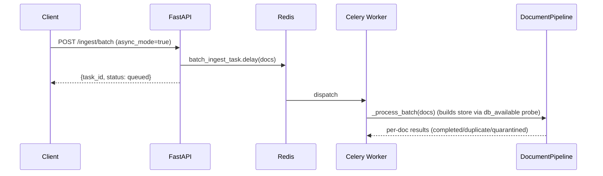
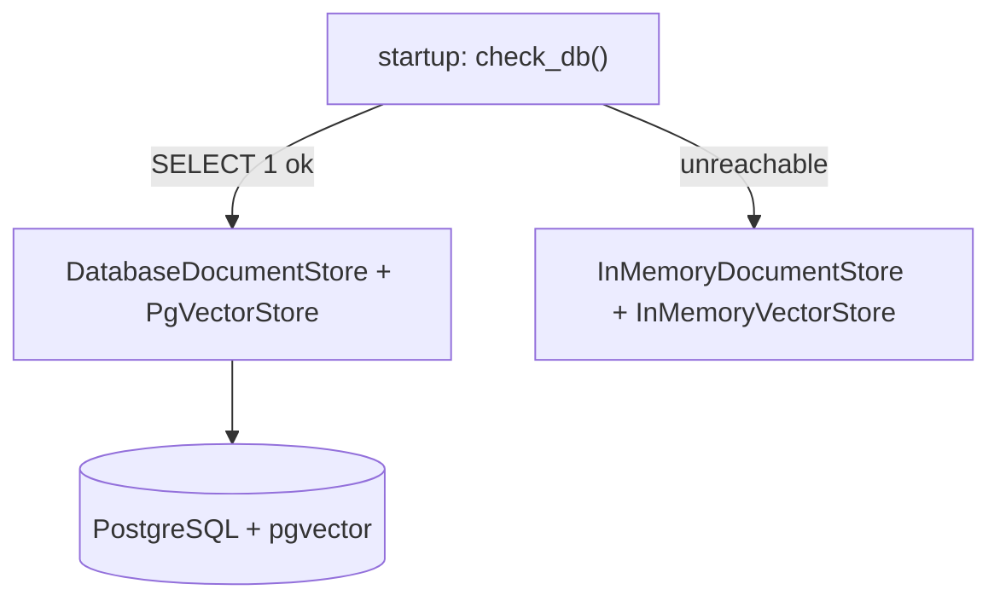

# Architecture Overview

This document describes the system architecture, component responsibilities, data flow, and persistence model of the Document Intelligence Pipeline as implemented.

## System Overview

The pipeline converts heterogeneous file formats into clean, deduplicated, semantically chunked, vector-embedded, RAG-ready chunks. The processing model is:

**Parse → Clean → Metadata + Entities → Chunk → Dedup → Embed → Persist → Index**

Each stage is an independent, testable function/class. The orchestration lives in `DocumentPipeline` (`pipeline.py`), which is **store-agnostic**: it receives a document store and a vector store, so the identical code runs against in-memory backends (tests/demo) or PostgreSQL + pgvector (production).

The system is **offline-first**: with no API keys and no database it boots and serves using an in-memory document store, an in-memory vector store, and deterministic offline embeddings. It is **real-when-keyed**: `OPENAI_API_KEY` enables real OpenAI embeddings; a reachable `DATABASE_URL` enables PostgreSQL persistence and pgvector search.

## Component Map

| Module | File | Responsibility |
|--------|------|---------------|
| **API Layer** | `main.py` | FastAPI app; all ingestion/browse/search/quarantine/export/health endpoints. Selects persistence backend on startup. |
| **Pipeline** | `pipeline.py` | `DocumentPipeline` — orchestrates the full flow; quarantines failures; runs search and quarantine-reprocess. |
| **Parser** | `parsers.py` | `DocumentParser` — thin adapter over `shared_core.docparse.get_parser`; normalises missing-dep/unsupported into `ParseError`. |
| **Cleaner** | `cleaners.py` | `clean_extracted_text()` — whitespace normalisation. |
| **Metadata** | `metadata.py` | `extract_metadata()` — title, author, dates, word/char/page counts. |
| **Entities** | `entities.py` | `extract_entities()` — emails, URLs, phones, capitalised n-grams (regex/heuristic). |
| **Chunker** | `chunkers.py` | `Chunker` (over `shared_core.docparse.chunk_text`) + legacy `SlidingWindowChunker`. |
| **Dedup** | `dedup.py` | `content_hash`, `dedup_chunks` — over `shared_core.docparse` (`compute_hash`, `filter_duplicates`). |
| **Embeddings** | `embeddings.py` | `EmbeddingGenerator` — sync facade over `shared_core.embeddings` providers (offline default). |
| **Document Store** | `storage.py`, `storage_db.py` | In-memory and SQLAlchemy stores (same interface): documents, chunks, jobs, quarantine. |
| **DB probe** | `db.py` | `check_db()` / `build_store()` — `db_available` pattern selecting DB vs in-memory. |
| **Exporter** | `exporters.py` | `JSONLExporter`, `to_rag_records` — RAG-ready JSONL. |
| **Worker** | `worker.py` | Celery `process_document_task` / `batch_ingest_task` over `shared_core.tasks`; importable without a broker. |
| **Models** | `models.py` | `Document`, `Chunk`, `ProcessingJob`, `QuarantineEntry` ORM models. |

### shared-core leverage

| Used | From | For |
|------|------|-----|
| `get_parser`, `chunk_text`, `ChunkStrategy`, `compute_hash`, `filter_duplicates`, `ParsedDocument` | `shared_core.docparse` | Parsing, chunking, dedup |
| `get_embedding_provider`, `HashFallbackProvider` | `shared_core.embeddings` | Offline-first embeddings |
| `get_vector_store`, `InMemoryVectorStore`, `VectorRecord` | `shared_core.vectorstore` | Similarity search |
| `DatabaseManager`, `Base`, `UUIDMixin`, `TimestampMixin` | `shared_core.database` | Persistence |
| `create_celery_app` | `shared_core.tasks` | Worker |
| `check_health`, `application_error_handler`, `RequestLoggingMiddleware`, `setup_logging` | `shared_core` | Cross-cutting |
| `MockDatabase`, `MockRedisClient` | `shared_core.testing` | Tests |

## Data Flow

### Synchronous ingestion (`POST /ingest`, `/ingest/text`)

### Asynchronous batch (`POST /ingest/batch?async`)

### Search (`POST /search`)

## Persistence Model

The `db_available` probe (`db.py`) runs on startup: it executes `SELECT 1`, creates tables if reachable, and sets `db_available`. `build_store()` then returns a `DatabaseDocumentStore` (PostgreSQL) or an `InMemoryDocumentStore`. The vector store mirrors this: pgvector when a DB is configured, `InMemoryVectorStore` otherwise.

### Schema (`models.py`, migrated via Alembic)

- **documents** — `id`, `filename`, `format`, `file_size_bytes`, `total_chunks`, `content_hash` (unique, indexed), `title`, `author`, `word_count`, `doc_metadata` (JSON), `entities` (JSON), timestamps.
- **chunks** — `id`, `document_id` (FK, indexed), `chunk_index`, `content`, `word_count`, `content_hash` (indexed), `embedding` (JSON), timestamps.
- **processing_jobs** — `id`, `filename`, `status` (indexed: queued/processing/completed/failed), `document_id`, `total_chunks`, `error`, timestamps.
- **quarantine** — `id`, `filename`, `format`, `file_size_bytes`, `reason`, `content_b64` (for reprocessing), timestamps.

> Chunk embeddings are stored as JSON in the relational table so the schema is SQLite-testable. Semantic *search* uses the separate vector store (pgvector with a DB, in-memory otherwise), keeping retrieval fast and the relational schema portable.

## Background Jobs

`worker.py` builds a Celery app via `shared_core.tasks.create_celery_app` (unified logging, JSON serialisation, UTC). It is importable with no broker — Celery only connects when a worker starts or `.delay()` is called. Tasks:

| Task | Description |
|------|-------------|
| `process_document_task(filename, content_b64)` | Ingest one base64 document. |
| `batch_ingest_task(documents)` | Ingest a batch; quarantine failures; return per-doc summary. |

The pure logic (`_process_one`, `_process_batch`) is unit-testable without Celery, and each worker call builds a store via the same `db_available` probe.

## Failure Handling

- **Parse/format/dependency failures** are caught by the pipeline and **quarantined** (file bytes retained), never aborting a batch. Listed via `GET /quarantine`, reprocessable via `POST /quarantine/{id}/reprocess`.
- **`BaseApplicationError`** subclasses (`ValidationError`, `NotFoundError`) map to structured JSON via `application_error_handler`.
- **DB/Redis outages** → `GET /health` reports `degraded`; the API stays up using in-memory fallbacks.

See [failure-modes.md](failure-modes.md) for the full matrix.
