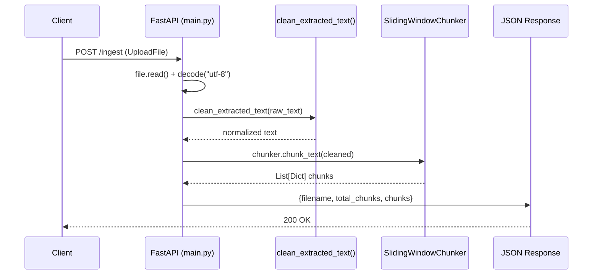
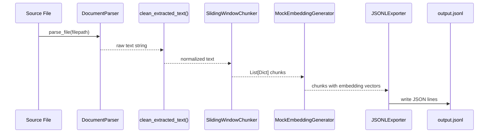
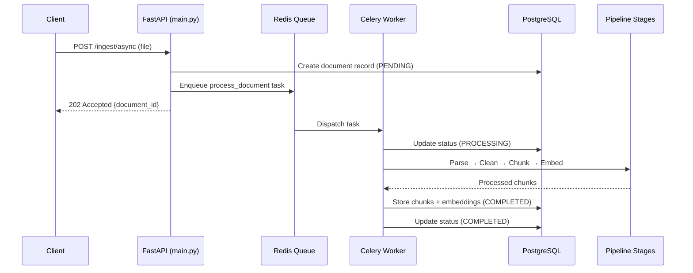
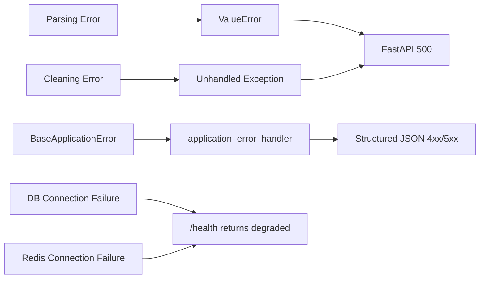

# Architecture Overview

This document describes the system architecture, component responsibilities, data flow, and infrastructure topology of the Document Intelligence Pipeline.

## System Overview

The Document Intelligence Pipeline is a multi-stage document processing system that converts heterogeneous file formats into structured, vector-embedded chunks suitable for Retrieval-Augmented Generation (RAG). The pipeline follows a linear processing model: **Parse → Clean → Chunk → Embed → Export**, with each stage implemented as an independent, testable module.

The system exposes a FastAPI REST API for synchronous file ingestion and includes a Celery worker scaffold for future asynchronous batch processing. All infrastructure (PostgreSQL with pgvector, Redis) runs in Docker containers defined in `docker-compose.yml`.

## Component Map

| Module | File | Responsibility |
|--------|------|---------------|
| **API Layer** | `main.py` | FastAPI application with `/ingest` and `/health` endpoints. Orchestrates the synchronous pipeline. |
| **Configuration** | `config.py` | `AppConfig` extending `shared_core.config.BaseAppConfig`. Sets `APP_NAME` to `document-intelligence-pipeline`. |
| **Document Parser** | `parsers.py` | `DocumentParser` class dispatching to format-specific extraction methods based on file extension (`.txt`, `.md`, `.html`). |
| **Text Cleaner** | `cleaners.py` | `clean_extracted_text()` function using regex to collapse whitespace and strip leading/trailing space. |
| **Chunker** | `chunkers.py` | `SlidingWindowChunker` class splitting text into word-based overlapping chunks with configurable `chunk_size` (default: 200) and `overlap` (default: 50). |
| **Embedding Generator** | `embeddings.py` | `MockEmbeddingGenerator` producing deterministic vectors by hashing character ordinals. Configurable `dimension` (default: 1536). |
| **Exporter** | `exporters.py` | `JSONLExporter` writing a list of chunk dictionaries to a JSONL file, one JSON object per line. |
| **Background Worker** | `worker.py` | Celery application using Redis as broker/backend. Contains a placeholder `sample_background_task`. |
| **Error Handler** | `errors.py` | `application_error_handler()` mapping `shared_core.errors.BaseApplicationError` to structured JSON responses. |

### shared-core Dependencies

The pipeline imports the following from the `shared-core` library:

- `shared_core.config.BaseAppConfig` — Pydantic settings base class with `DATABASE_URL`, `REDIS_URL`, `LOG_LEVEL`
- `shared_core.database.DatabaseManager` — SQLAlchemy session factory with connection pooling
- `shared_core.redis.RedisManager` — Redis client wrapper with `ping()` health check
- `shared_core.logging.setup_logging` — Loguru-based structured logging configuration
- `shared_core.errors.BaseApplicationError` — Base exception with `status_code`, `code`, `message` attributes

## Data Flow

### Synchronous Ingestion (`POST /ingest`)



> **Note:** The current `/ingest` endpoint bypasses `DocumentParser` entirely — it reads uploaded bytes directly as UTF-8 text. The parser is instantiated in `main.py` but not called in the endpoint handler.

### Full Pipeline (Demo / Planned)



This full pipeline is demonstrated in `examples/run_demo.py`, where all stages (parse → clean → chunk → embed) run end-to-end on a sample text file.

### Planned Async Flow (Celery)



## Storage Model

### Current State

No database schema exists. PostgreSQL runs in Docker but no tables are created. Document and chunk metadata are returned as in-memory dictionaries.

### Planned Schema

```sql
-- Document metadata and processing status
CREATE TABLE documents (
    id              UUID PRIMARY KEY DEFAULT gen_random_uuid(),
    filename        TEXT NOT NULL,
    file_hash       TEXT NOT NULL UNIQUE,   -- SHA-256 for deduplication
    file_size       INTEGER,
    mime_type       TEXT,
    status          TEXT DEFAULT 'pending', -- pending | processing | completed | failed | quarantined
    error_message   TEXT,
    created_at      TIMESTAMPTZ DEFAULT now(),
    processed_at    TIMESTAMPTZ
);

-- Semantic chunks with embeddings
CREATE TABLE chunks (
    id              UUID PRIMARY KEY DEFAULT gen_random_uuid(),
    document_id     UUID REFERENCES documents(id) ON DELETE CASCADE,
    chunk_index     INTEGER NOT NULL,
    content         TEXT NOT NULL,
    content_hash    TEXT NOT NULL,          -- For chunk-level deduplication
    word_count      INTEGER,
    embedding       vector(1536),          -- pgvector column
    metadata        JSONB,                 -- Title, headings, page number, etc.
    created_at      TIMESTAMPTZ DEFAULT now()
);

CREATE INDEX idx_chunks_embedding ON chunks USING ivfflat (embedding vector_cosine_ops);
CREATE INDEX idx_chunks_document ON chunks (document_id);
CREATE INDEX idx_documents_status ON documents (status);
CREATE INDEX idx_documents_hash ON documents (file_hash);
```

## Background Jobs

### Current State

`worker.py` defines a Celery application using Redis as both broker and result backend:

```python
celery_app = Celery(config.APP_NAME, broker=config.REDIS_URL, backend=config.REDIS_URL)
```

Configuration: JSON serialization, UTC timezone, accepts only JSON content.

The only registered task is `sample_background_task(x, y) -> int`, a placeholder that adds two integers.

### Planned Tasks

| Task | Description |
|------|-------------|
| `process_document` | Full pipeline execution for a single document (parse → clean → chunk → embed → store) |
| `process_batch` | Folder ingestion — discover files, enqueue individual `process_document` tasks |
| `recompute_embeddings` | Re-embed all chunks when switching embedding models |
| `export_chunks` | Generate JSONL export for a set of documents |

## External Dependencies

| Service | Required | Purpose |
|---------|----------|---------|
| PostgreSQL 16 (pgvector) | Yes | Document metadata, chunk storage, vector similarity search |
| Redis 7 | Yes | Celery task broker, result backend, processing status cache |
| OpenAI API | No (future) | Real embedding generation via `text-embedding-3-small` |
| File system | Yes | Reading source documents, writing JSONL exports |

## Failure Handling

### Current Implementation

- **Error handler** (`errors.py`): Maps `BaseApplicationError` exceptions to structured JSON with `error`, `message`, and `status` fields
- **Health check** (`GET /health`): Wraps database and Redis checks in try/except, reports `degraded` if either fails — the API stays up regardless
- **Parser** (`parsers.py`): Raises `ValueError` for unsupported file extensions — no retry or quarantine logic

### Error Propagation Path



Unhandled exceptions in pipeline stages currently propagate as raw 500 errors. The `application_error_handler` only catches `BaseApplicationError` subclasses — pipeline-specific errors need dedicated exception types (planned: `ParseError`, `ChunkError`, `EmbeddingError`).

## Security Boundaries

- **File access**: `DocumentParser` reads arbitrary filesystem paths via `open()` — no path validation or sandboxing
- **Upload handling**: `POST /ingest` accepts any file via `UploadFile` — no size limits, type validation, or content scanning
- **Database**: `DatabaseManager` uses connection string from environment — no query parameterization issues (SQLAlchemy ORM handles this)
- **Redis**: Unauthenticated local connection — acceptable for development, not production
- **API keys**: `OPENAI_API_KEY` in `.env.example` — not used in current code, but present for future embedding integration
- **No authentication**: All endpoints are publicly accessible — no API key, JWT, or session middleware

See [docs/security.md](docs/security.md) for detailed security analysis.
