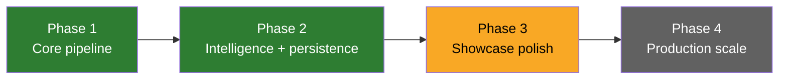

# Project Roadmap — Document Intelligence Pipeline

Status of each capability against the showcase MVP. See [EXECUTION_PLAN.md](EXECUTION_PLAN.md) for the detailed build log.

## Phase 1 — Core Processing Pipeline (done)

- [x] Multi-format extraction via `shared_core.docparse.get_parser` (txt, md, html, pdf, docx)
- [x] Text cleaning / whitespace normalisation
- [x] Configurable chunking via `shared_core.docparse.chunk_text` (fixed / semantic / structural)
- [x] Offline-first embeddings via `shared_core.embeddings`
- [x] RAG-ready JSONL exporter (`to_rag_records`)

## Phase 2 — Intelligence & Persistence (done)

- [x] Metadata extraction (title, author, dates, word/char/page counts)
- [x] Heuristic entity extraction (emails, URLs, phones, capitalised n-grams)
- [x] Content-hash deduplication (document + chunk level)
- [x] Database schema: `documents`, `chunks`, `processing_jobs`, `quarantine` + Alembic migration
- [x] DB persistence by default with in-memory fallback (`db_available` probe)
- [x] Error quarantine: record, list, reprocess
- [x] Vector similarity search via `shared_core.vectorstore` (in-memory / pgvector)
- [x] Real Celery worker: `process_document_task`, `batch_ingest_task` (importable with no broker)
- [x] Endpoints: ingest (file/text), ingest/batch, documents, chunks, search, quarantine, export, health

## Phase 3 — Showcase Polish (next)

- [ ] Webhook callbacks on processing completion
- [ ] Chunk-preview API with match highlighting for search hits
- [ ] Processing-throughput / error-rate metrics endpoint (Prometheus via `shared_core.metrics`)
- [ ] Job-status endpoint surfacing `processing_jobs` lifecycle to a dashboard
- [ ] Deeper integration hooks for `rag-evaluation-lab` export consumption

## Phase 4 — Advanced Intelligence & Production Scale (future)

- [ ] OCR fallback for scanned/image-only PDFs (Tesseract)
- [ ] Trained NER (spaCy) replacing the heuristic entity extractor
- [ ] PII detection & redaction before storage/export
- [ ] Semantic deduplication (MinHash LSH) across large corpora
- [ ] Topic-boundary semantic chunking
- [ ] Incremental re-processing of changed files (re-chunk diffs only)
- [ ] Auto-scaling workers on queue depth; upload size caps & streaming reads
- [ ] Quarantine retention policy (TTL / size cap)
