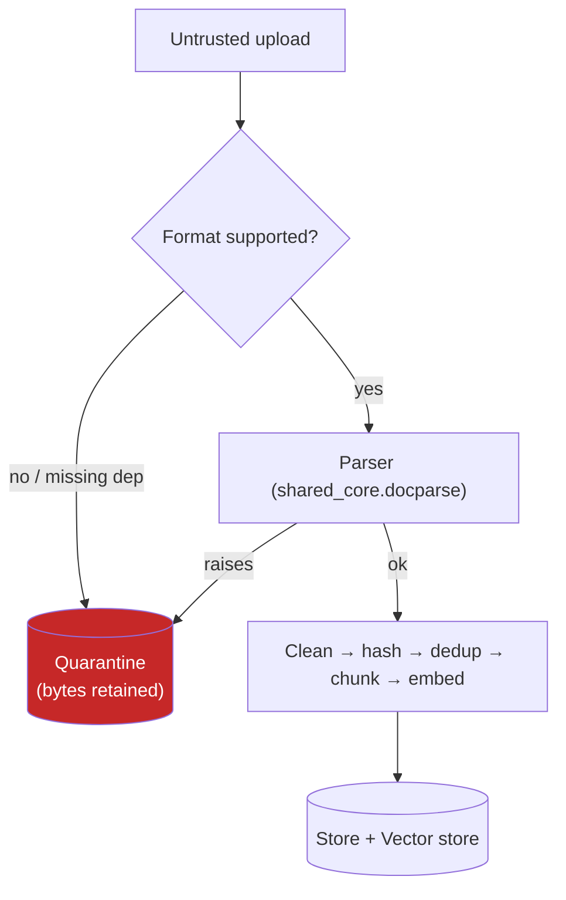

# Security Boundaries & Rules — Document Intelligence Pipeline

Security parameters, input-validation boundaries, and risk model. Items are marked **[implemented]** or **[planned]** to reflect the current code honestly.

## Threat Model (high level)

The primary risks are **malicious/malformed documents** (parser exploits, decompression bombs), **resource exhaustion** (large files, deep PDFs), and **data confidentiality** (PII in documents, embeddings, and exports).

## 1. Safe Ingestion & File Validation

- **Extension/MIME-based dispatch** — **[implemented]** `shared_core.docparse.get_parser` resolves a parser by extension/MIME; unknown types raise `ParseError` and are quarantined rather than processed. Note this is *routing*, not an allowlist security control on its own.
- **Graceful parse failure** — **[implemented]** any parser exception (corrupt bytes, decompression error) is caught and quarantined; it never crashes the service or aborts a batch.
- **Magic-number verification** — **[planned]** verify content matches the declared type (forged extensions); pair with a strict upload allowlist.
- **File size caps** — **[planned]** enforce a max upload size and reject oversized requests early (413) to mitigate DoS.

## 2. Sandboxing & Path Safety

- **No filesystem write from uploads** — **[implemented]** uploaded bytes are processed in memory and persisted to the store; the API never writes uploads to a path derived from a user-supplied filename, so directory-traversal-to-disk is not a vector. (`DocumentParser.parse_file` reads from disk only for the local demo/CLI path, not the HTTP path.)
- **Parser resource limits** — **[planned]** run parser workers with CPU/memory limits (container `--memory`, `--cpus`) to contain malicious PDFs (deep recursion, billion-laughs). `shared_core.tasks` sets a Celery `task_time_limit`.
- **`noexec` upload storage** — **[planned]** if/when uploads are spooled to disk, mount that location non-executable.

## 3. Data Protection & Confidentiality

- **No raw content in logs** — **[implemented]** the pipeline logs filenames, statuses, and reasons, not chunk text or full document bodies. Request logging is via `shared_core.logging.RequestLoggingMiddleware`.
- **PII in extracted entities** — **[awareness]** the entity extractor surfaces emails/phones by design; treat the `entities` field and exports as potentially sensitive. PII redaction is a **[planned]** Phase 4 layer.
- **Quarantine retains file bytes** — **[awareness]** failed files are stored base64-encoded for reprocessing. This is convenient but means raw (possibly sensitive) bytes persist until reprocessed/removed; a retention policy is **[planned]**.
- **Credentials & transport** — **[implemented]** DB/Redis/API-key config comes from environment via `shared_core.config` (`OPENAI_API_KEY` is a `SecretStr`); secrets are never hard-coded. **[planned]** enforce TLS to PostgreSQL/Redis in production and restrict DB credentials to least privilege.

## 4. API Exposure

- **No authentication** — **[planned]** all endpoints are currently unauthenticated (appropriate for a local showcase). Production needs an API key / JWT layer and rate limiting (`shared_core.ratelimit`).
- **Structured errors only** — **[implemented]** `application_error_handler` returns structured JSON for `BaseApplicationError`; raw stack traces are not exposed for handled error paths.
- **Input validation** — **[implemented]** Pydantic models validate request bodies (e.g., `search.top_k` bounded 1–50), rejecting malformed input with 422.
